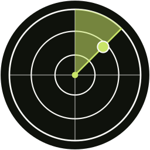

<picture>
  <source media="(prefers-color-scheme: dark)" srcset="incidentlab-icon-dark-256.png">
  <source media="(prefers-color-scheme: light)" srcset="incidentlab-icon-light-256.png">
  
</picture>

# IncidentLab

**A cybersecurity library for practitioners.**
Write-ups, DFIR notes, SOC playbooks, references, and conversations from the field.

### زكاة العلم نشره

 

---

## What this is

IncidentLab is **a cybersecurity library and a session series**.

The library side is security operations material built for the moment you actually need it: artifacts, references, runbooks, and write-ups that real responders reach for during an incident. The session side is conversations with practitioners walking through real cases in their own corner of the field.

A library for practitioners, by practitioners.

## Sections

| Section | What lives there |
| :-- | :-- |
| [**Tools**](https://theincidentlab.com/tools/) | Tooling notes and practical usage for the DFIR/SOC stack |
| [**References**](https://theincidentlab.com/references/) | Artifact references and lookups worth keeping open during an incident |
| [**SOC**](https://theincidentlab.com/soc/) | Playbooks, detection engineering, and security operations material |
| [**Articles**](https://theincidentlab.com/articles/) | Longer-form writing from the field |
| [**Write-ups**](https://theincidentlab.com/writeups/) | Case walkthroughs and investigation notes |
| [**About**](https://theincidentlab.com/about/) | Who is behind IncidentLab |

## Sessions

Conversations with practitioners, recorded and published on [YouTube](https://www.youtube.com/@INCIDENTLAB-dz6dd/videos).

| Episode | Guest | Focus |
| :-- | :-- | :-- |
| **Modern CTI Tradecraft** | Abdulrahman Al-Omari | Threat intelligence |
| **The Enemy is Our Mindset** | Taha Hakeem | Human factor |
| **The Art of Use Cases** | Mohammad Al-Shawi | Detection engineering |
| **Beyond the Blind Spots** | Ibrahim Bahah | Defensive · SOC ops |
| **Low Priv to Domain Admin** | Mohammad Kantar | Offensive · Active Directory |
| **Unmasking Cobalt Strike** | Mohammad Al-Zahrani | Offensive · Evasion |

## Behind IncidentLab

**Sarah Aljaber**  
Founder · Senior Incident Response Consultant · DFIR & Cybersecurity  
Riyadh, Saudi Arabia

Sarah is a Senior Incident Response Consultant focused on building and strengthening
Security Operations Centers and enterprise detection capabilities: visibility,
monitoring strategy, detection use case development, log baselining, and proactive
threat hunting aligned to evolving adversary techniques.

[LinkedIn](https://www.linkedin.com/in/sarah-aljaber-mba-195b3717a) · [X](https://x.com/s4o_o) · [YouTube](https://www.youtube.com/@INCIDENTLAB-dz6dd/videos)

---

**© 2026 IncidentLab. All rights reserved.**

Built for the people answering the 3 AM calls.

